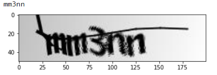
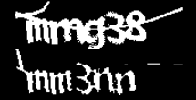
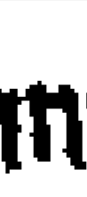
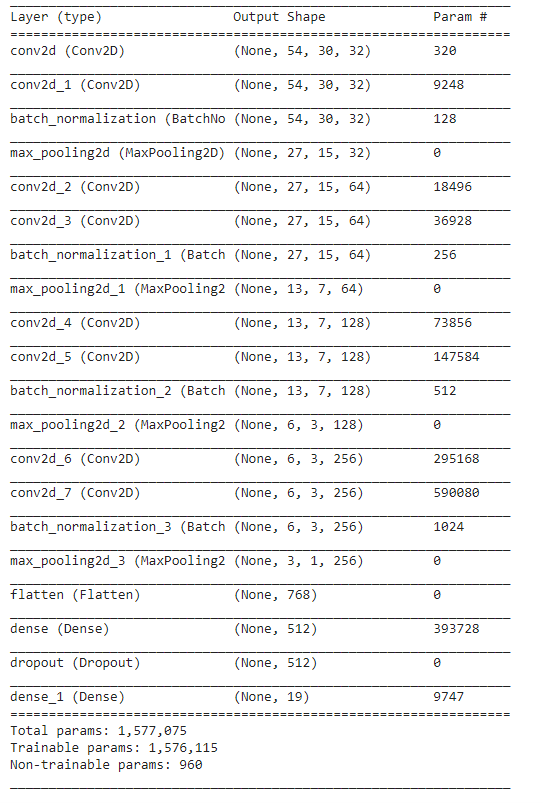
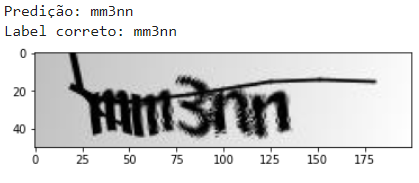

# Quebrando Captcha de Seguranca
Este projeto utiliza conhecimentos de processamento de imagens e machine learning para quebrar captchas de segurança. O dataset utilizado contém captchas com 19 tipos de digitos, sendo eles: 

 - 2 3 4 5 6 7 8 b c d e f g m n p w x y.

Link do dataset: https://www.kaggle.com/fournierp/captcha-version-2-images

Este trabalho utilizou  bibliotecas do python, sendo elas: tensorflow, keras e opencv.
As imagens do dataset foram pré-processadas e separadas em 70% para treinamento 20% para testes e 10% para validação. As imagens originais estavam na escala de cinza e passou por processos de limialização e binarização.

 - Imagem Original
 
 

 O processo de limiarização consiste na transformação de uma imagem em escala de cinza para uma imagem binária. A limiarização mais simples é a definida por um limite predefinido, onde tudo que for menor que esse limite é transformado para um valor, e maior que ele para outro valor.

- Imagem limiarizada e binarizada

 
 
 Com o intuito de remover ruidos e outras imperfeições das imagens, elas também sofreram o processo de erosão.
 
 - Imagem após a erosão
 
 
 
 Cada captcha contém 5 digitos, logo cada imagem de captcha foi recortada em 5 imagens diferentes, sendo cada uma referente a um digito.
 
  - Digito recortado
  
 
 
 Utilizando as bibliotecas tensorflow e keras do python, foi dessenvolvida e treinada uma arquitetura de rede neural, que pode ser visualizada abaixo:
 
 
  A CNN foi treinada com os digitos recortados e obteve uma acurácia de 96.73%.
 
 - Predição obtida pelo modelo
 
  
